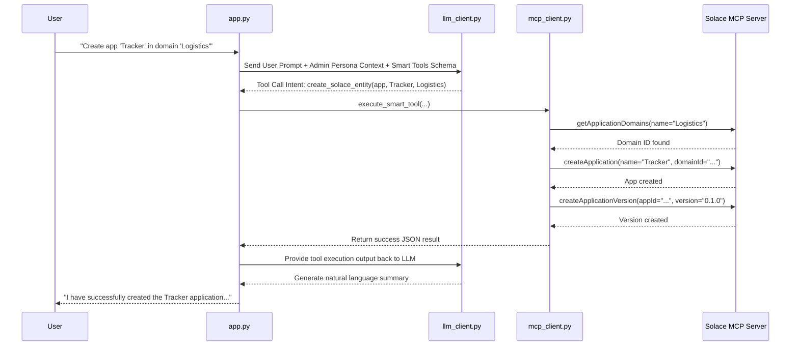

# EventFlow AI — System Architecture

This document provides a comprehensive breakdown of the **EventFlow AI** system architecture, focusing on the integration of local LLMs with the Solace Event Portal via the Smart Router pattern.

---

## 💡 What is the Smart Router?

The **Smart Router** is the core design pattern of EventFlow AI. Instead of giving the LLM direct access to dozens of complex, highly-granular Solace Event Portal API endpoints (which causes hallucinations, token bloat, and confusion), the Smart Router acts as an intelligent middleman. 

It provides the LLM with just a few simple, generalized tools (like "search" and "create"). When the LLM uses one of these tools, the Smart Router intercepts the request and handles all the complex backend logic—like resolving ID lookups, chaining multiple API calls together, handling auto-versioning, and filtering massive JSON responses into clean summaries—before returning the final, pruned result back to the AI.

---

## 1. System Architecture Diagram

The architecture is designed to keep all natural language processing local while interfacing securely with the Solace Cloud. 

```mermaid
graph TD
    User([User]) <--> CLI[app.py\nCLI Orchestrator]
    
    subgraph EventFlow AI Core (Python)
        CLI <--> LLM[llm_client.py\nPersona Engine]
        CLI <--> Router[mcp_client.py\nSmart Router]
    end

    Router <-->|stdio RPC| MCPS[Solace MCP Server\nNode.js Process]
    MCPS <-->|HTTPS| SolaceCloud[(Solace Event Portal\nCloud REST API)]
    LLM <-->|Local API| LocalLLM[(Local Ollama\ne.g. qwen3:8b)]
    
    style EventFlow AI Core fill:#1a1a24,stroke:#555,stroke-width:2px,color:#fff
    style Router fill:#2d3748,stroke:#63b3ed,stroke-width:3px,color:#fff
```

---

## 2. End-to-End Execution Flow

This section details exactly what happens from the moment the user types a prompt until the final answer is rendered on the screen.

### Flow Diagram



### Step-by-Step Explanation
1. **User Input & Orchestration:** The user types a prompt. `app.py` intercepts this and bundles it with the active persona's instructions (e.g., granting the Admin mutation capabilities) and the JSON schemas of our generalized tools.
2. **LLM Decision:** The local Ollama model analyzes the request. It determines it needs external data/actions, so it pauses text generation and emits a structured **Tool Call** (e.g., `create_solace_entity`).
3. **Smart Router Interception:** `app.py` catches the tool call and routes it to `mcp_client.py` (The Smart Router).
4. **Backend Translation:** The Smart Router executes custom Python logic to map the simple LLM request into complex Solace API sequences. For example, creating an application requires resolving the Domain ID first, creating the application, and then automatically creating an initial `0.1.0` version.
5. **Tool Resolution:** The Smart Router returns a clean, pruned JSON response back to `app.py`, stripped of unnecessary metadata.
6. **Final Synthesis:** `app.py` feeds this clean JSON back to the LLM. The LLM reads the result and generates a final human-readable response, which `app.py` prints to the terminal.

---

## 3. Working of Each Component

### `app.py` (CLI Orchestrator)
This is the entry point of the application. 
- **User Interface:** It runs the interactive console, handles persona selection (Admin vs. End User), and manages the continuous chat loop.
- **Async Management:** It spins up the Python `asyncio` event loop and maintains the persistent connection to the MCP server.
- **Traffic Controller:** It handles the back-and-forth orchestration between the LLM and the tools. When the LLM requests a tool, `app.py` pauses the chat, routes the request to the Smart Router, and injects the response back into the conversation history.

### `llm_client.py` (LLM Interface & Persona Engine)
This component manages all interactions with the local AI.
- **OpenAI Compatibility:** It uses the standard Python `openai` SDK to talk to a locally running Ollama instance, ensuring 100% data privacy.
- **Persona Management:** It holds the `SYSTEM_PROMPTS` dictionaries. If the user is an Admin, it injects a prompt allowing state mutation (`create_solace_entity`). If the user is an End User, it restricts the LLM to read-only queries.
- **Schema Mapping:** It transforms the generalized tool dictionaries defined in the Smart Router into the strict JSON schema required by the OpenAI API spec.

### `mcp_client.py` (The Smart Router)
This is the core innovation of the architecture. Exposing the raw Solace Event Portal API directly to an LLM causes hallucinations, context window exhaustion, and complex chaining errors.
- **Tool Generalization:** It defines a small, high-level set of tools (`search_solace_entity`, `get_entity_relationships`, `create_solace_entity`) that are easy for the LLM to understand.
- **The Interceptor (`execute_smart_tool`):** When the LLM calls a generalized tool, this function intercepts it.
- **Complex API Mapping:** It runs custom Python logic to fulfill the high-level intent. If the LLM asks for an app's events, the router automatically chains `getApplications` → `getApplicationVersions` → `getEventVersions` behind the scenes.
- **Payload Pruning:** It strips massive, noisy JSON payloads from the Solace Cloud down to just the essential `id` and `name` properties, saving thousands of tokens and improving AI accuracy.

### `config.py` (Environment Configuration)
A simple utility module that loads environment variables from the `.env` file, managing secrets like the `SOLACE_API_TOKEN` and local URLs like the `OLLAMA_BASE_URL`.

---

## 4. How Our Solution Works Internally

The Smart Router is NOT a heavy, independent middleware service (like a standalone proxy server). Instead, it is implemented as a lightweight abstraction layer bundled directly inside the agent's `mcp_client.py` module.

By embedding this hardcoded translation layer directly in the application, we guarantee 100% API chaining accuracy without the latency, deployment complexity, or maintenance overhead of a separate middleware server.

### Example A: Internal READ Operation (Fetching Produced Events)
When the LLM calls a generic tool (e.g., requesting the produced events for an App ID), `mcp_client.py` intercepts the call natively and executes a rigorous Python workflow behind the scenes:

1. **Step 1:** It queries the Solace `getApplicationVersions` endpoint and isolates the latest version object.
2. **Step 2:** It parses the version object to extract the raw `declaredProducedEventVersionIds` array.
3. **Step 3:** It iterates through those version IDs and calls the `getEventVersions` endpoint to fetch the parent Event IDs.
4. **Step 4:** It calls the `getEvents` endpoint using those parent IDs to resolve the human-readable names and descriptions.

Finally, the Python execution engine packages this deeply nested data into a clean, flat dictionary. This minified data is handed back to the LLM.

### Example B: Internal WRITE Operation (Creating an Application)
When the LLM calls a generic tool to create an entity (e.g., creating an Application inside a specific Domain), the Smart Router handles the complex required parameters and dependencies:

1. **Step 1 (ID Resolution):** The LLM provides the Domain *name*, but Solace requires a Domain *ID*. The router silently calls `search_solace_entity` -> `getApplicationDomains` to find the exact Domain ID.
2. **Step 2 (Creation):** It calls the `createApplication` endpoint, injecting the resolved Domain ID along with required fields that the LLM shouldn't have to guess (like `"applicationType": "standard"` and `"brokerType": "solace"`).
3. **Step 3 (Auto-Versioning):** In Solace, an application cannot exist without a version. The router immediately calls `createApplicationVersion` to initialize the `0.1.0` version automatically.

Finally, the router packages the IDs of both the newly created Application and its initial Version, returning a clean summary back to the LLM.
